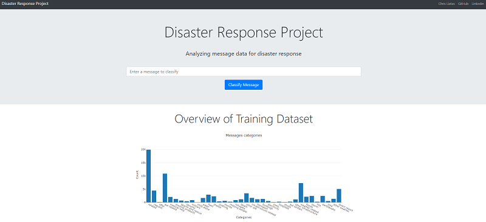
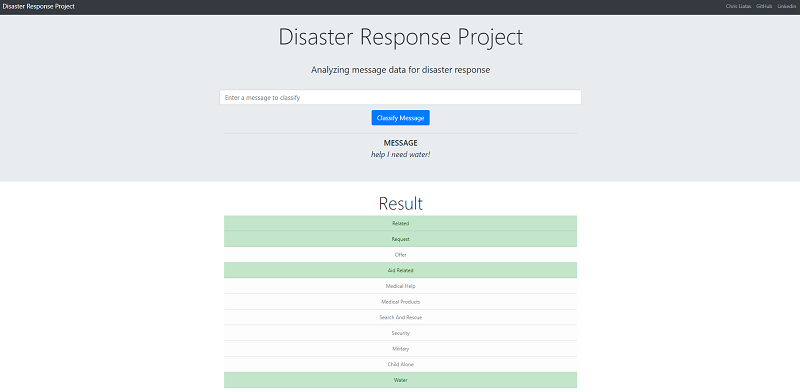
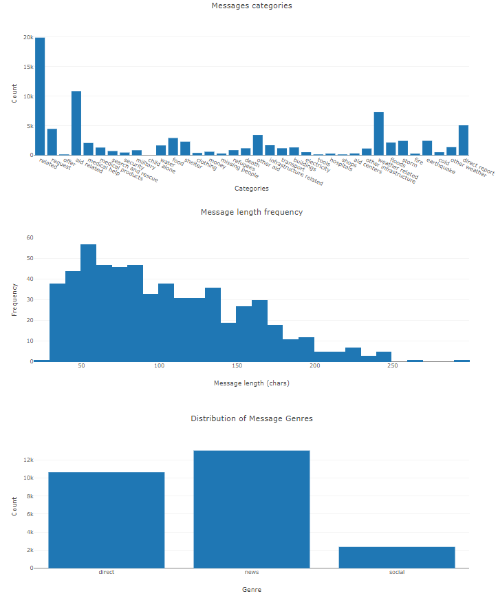

# Disaster Response ML Workflow Project

The purpose of this project is to build a model for an API that classifies disaster messages. The idea is to create a machine learning pipeline to categorize these events so that these messages can be send to an appropriate disaster relief agency. Project includes a web app where an emergency worker can input a new message and get classification results in several categories. The web app also displays visualizations of the data. This project is built using Flask, Bootstrap, Plotly, NLTK to work with human language data and Pandas for data wrangling. Data is provided by [Figure Eight](https://www.figure-eight.com/).





### Output - Results

The project is divided into three parts with respective outcomes / results for each part.

#### 1. ETL pipeline

The first part of our data pipeline is the Extract, Transform, and Load process. Here, we read the dataset, clean the data, and then store it in a SQLite database. Data cleaning is done with pandas. The Python script merges the messages and categories datasets, splits the categories column into separate, clearly named columns, converts values to binary, and drops duplicates. The corresponding Python script is `process_data.py`. The output of this part is the `DisasterResponse.db`.

#### 2. Machine Learning Pipeline

For the machine learning portion, we split the data into a training set and a test set. Then, we create a machine learning pipeline that uses NLTK, as well as scikit-learn's Pipeline and GridSearchCV to output a final model that uses the `message` column to predict classifications for 36 categories ([multi-output classification](https://scikit-learn.org/stable/modules/multiclass.html#multilabel-classification)). The script uses a custom tokenize function using NLTK to case normalize, lemmatize, and tokenize text. An additional function is used to replace word contractions for most unambiguous cases. This function is used in the machine learning pipeline to vectorize and then apply [TF-IDF](https://scikit-learn.org/stable/modules/generated/sklearn.feature_extraction.text.TfidfTransformer.html) to the text. Finally, the trained model is exported to a pickle file. The corresponding Python script is `train_classifier.py`. The output of this part is the `classifier.pkl` as well as console output like the following:

```bash
Loading data...
    DATABASE: data/DisasterResponse.db
Building model...
Training model...
Evaluating model...
                        precision    recall  f1-score   support

               related       0.84      0.95      0.89      3972
               request       0.84      0.49      0.62       916
                 offer       0.00      0.00      0.00        14
           aid_related       0.76      0.70      0.73      2143
          medical_help       0.65      0.09      0.15       398
      medical_products       0.78      0.08      0.14       270
     search_and_rescue       0.78      0.05      0.09       148
              security       0.00      0.00      0.00        96
              military       0.53      0.06      0.11       159
           child_alone       0.00      0.00      0.00         0
                 water       0.82      0.49      0.61       310
                  food       0.83      0.59      0.69       581
               shelter       0.85      0.39      0.54       457
              clothing       0.60      0.08      0.15        72
                 money       0.75      0.02      0.05       125
        missing_people       0.00      0.00      0.00        62
              refugees       0.69      0.06      0.11       177
                 death       0.89      0.13      0.23       239
             other_aid       0.64      0.04      0.07       713
infrastructure_related       0.00      0.00      0.00       331
             transport       0.91      0.09      0.17       219
             buildings       0.73      0.12      0.20       256
           electricity       0.80      0.04      0.07       102
                 tools       0.00      0.00      0.00        36
             hospitals       0.00      0.00      0.00        57
                 shops       0.00      0.00      0.00        22
           aid_centers       0.00      0.00      0.00        64
  other_infrastructure       0.00      0.00      0.00       218
       weather_related       0.86      0.67      0.75      1429
                floods       0.92      0.46      0.61       414
                 storm       0.82      0.49      0.61       490
                  fire       0.50      0.02      0.03        59
            earthquake       0.90      0.77      0.83       476
                  cold       0.76      0.12      0.21       104
         other_weather       0.50      0.03      0.06       258
         direct_report       0.80      0.38      0.51      1019

           avg / total       0.76      0.53      0.58     16406


Best parameters model accuracy: 0.280

Grid search best score: 0.262

Saving model...
    MODEL: models/classifier.pkl
Trained model saved!
```

The best performing model was not required for this project and since model fitting is very time consuming the final trained model might not be the best but answers the project's requirements.

#### 3. Flask Web App

In the last step, our results are displayed in a Flask web [app](app/). The app provides a field where one can input a new message and get classification results in several categories. The web app also displays visualizations of the dataset. The visualizations are "Message categories frequency", "Message length frequency" and "Distribution of Message Genres". Flask app html templates have been created using [Bootstrap 4.6](https://getbootstrap.com/docs/4.6/getting-started/introduction/), [jQuery 3.5.1](https://code.jquery.com/jquery/) and javaScript [Plotly 2.3.1](https://plotly.com/javascript/getting-started/). Template is based on Bootstrap's official template [Jumbotron](https://getbootstrap.com/docs/4.6/examples/jumbotron/) and Udacity's provided starting code.



The dataset provided is **imbalanced** (ie some labels like water have few examples). In such cases, machine learning models will typically over-classify the larger classes due to their increased prior probability. This will provide instances belonging to the smaller classes that are typically misclassified more often than those belonging to the larger classes.

## Environment

The development environment used for working with the project was created on a Windows 10 pc with [devcontainers](https://code.visualstudio.com/docs/remote/containers).

The environment in the container is:

- Python 3.9.6

The main libraries used for this project are ([`requirements.txt`](requirements.txt) includes dependencies):

- jupyter
- scikit-learn
- nltk
- sqlalchemy
- flask
- pandas
- plotly
- gunicorn
- seaborn

## Files and project file structure

Important files:

- `app` is the flask application, including templates, static files, and routes.
- `data` is the where the data and produced database are kept.
- `data/process_data.py` is the python script is the ETL pipeline, where data processing, analysis and database creation occurs.
- `data/disaster_messages.csv` the dataset used for analysis containing more than 26000 messages, provided by Figure Eight.
- `data/disaster_categories.csv` categories for the above messages' classification, provided by Figure Eight.
- `models/train_classifier.py` is the ML workflow script, including data loading, building a text processing and machine learning pipeline, train and tune a model using [GridSearchCV](https://scikit-learn.org/stable/modules/generated/sklearn.model_selection.GridSearchCV.html), results output for the test set and Exporting the final model as a pickle file.
- `models/classifier.pkl` this is the saved trained model. It is a large file added to git using [`git lfs`](https://git-lfs.github.com/)
- `requirements.txt` contains the required python libraries to run the app.
- `run.py` imports the app and can be used to run the app on a local server.
- `.devcontainer` directory is for building the local development environment, check [here](https://code.visualstudio.com/docs/remote/devcontainerjson-reference) for more info.
- `.vscode` directory is for setting up [Visual Studio Code](https://code.visualstudio.com/) and debug configurations.
- `.github/workflows` github [actions](https://github.com/features/actions) for CI/CD workflows.
- `Dockerfile.dev` is the Dockerfile used to build the development container.
- `Procfile` is used to deploy the web app on [Heroku](http://heroku.com/).
- `nltk.txt` used for Heroku to [download NLTK data files](https://devcenter.heroku.com/articles/python-nltk)

Directories and files structure:

```
- app
|- static
| |- css
| | |- style.css  # custom style sheet used for the app template
| - templates
| |- master.html  # main page of web app
| |- go.html  # classification result page of web app
|- run.py  # Flask file that runs app

- data
|- disaster_categories.csv  # data to process
|- disaster_messages.csv  # data to process
|- ETL Pipeline Preparation.ipynb  # jupyter file for initial data exploration and development.
|- process_data.py
|- DisasterResponse.db   # database to save clean data to

- img  # contains app screenshots for this README
|- app_classify_800x392.png
|- app_main_800x366.png

- models
|- train_classifier.py
|- classifier.pkl  # saved model
|- ML Pipeline Preparation.ipynb  # jupyter file for initial development and ML pipeline attempts.

- LICENSE
- README.md
- requirements.txt
- ...
```

## Deployment

The project contains the files required to deploy the web app to Heroku. However, due to the large size of the trained model file (classifier.pkl) cannot be uploaded to a Heroku free tier git repo due to [limits](https://devcenter.heroku.com/articles/limits#git-repos) and lack of built-in Git LFS support.

## Running the app locally

To run locally you can clone this repository in a Windows 10 pc and use VS Code to open in a remote container. Please check instructions [here](https://code.visualstudio.com/docs/remote/containers-tutorial) if you are not familiar with devcontainers.
If you are developing a Linux machine, it may be easier to create a [virtual environment](https://docs.python.org/3/tutorial/venv.html) and run the app there.

### Instructions:

1. Run the following commands in the project's root directory to set up your database and model.

   - To run ETL pipeline that cleans data and stores in database
     `python data/process_data.py data/disaster_messages.csv data/disaster_categories.csv data/DisasterResponse.db`
   - To run ML pipeline that trains classifier and saves
     `python models/train_classifier.py data/DisasterResponse.db models/classifier.pkl`

2. Run the following command in the app's directory to run your web app.
   `python run.py`

3. Go to http://0.0.0.0:3001/ (or if using containers, to the corresponding port mapped.)

## Acknowledgments

- This project has been created as part of the [Udacity Data Science Nanodegree](https://www.udacity.com/course/data-scientist-nanodegree--nd025) course.
- Data is provided by [Figure Eight](https://www.figure-eight.com/)
